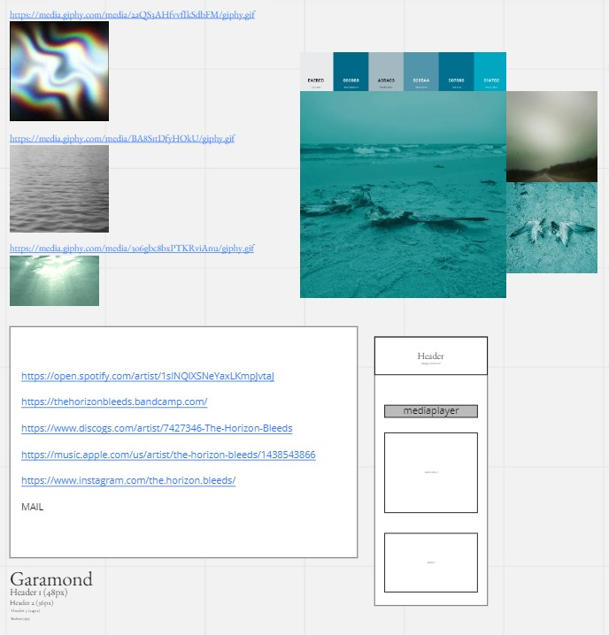

[font](https://fonts.google.com/specimen/EB+Garamond?query=garamond)

pkt: sass, axios, react-icons

anteckningar:
mediaplayer via bandcamps egna hemsida
discords API för att hämta upp discografi
https://api.discogs.com/artists/7427346/releases

12/1 - efter disskution med artisten så framkom önskemål om tracklist information till discografin, jobbas nu med att implementeras  
17/1 - tracklist äntligen implementerad. Tog orimligt mycket längre tid än vad det egentligen borde gjort. Jag är antagligen dum i huvuet.
* VA-skivorna, bara rendera ut THB-låten? Få ut artistnamnen iaf!
* scroll på de längre listorna

18/7 - todo:
* to-the-top knapp tack
* contact: email, instagram
* grid för links
* optimera för galaxy fold: 280px (mindre än 375px bredd)